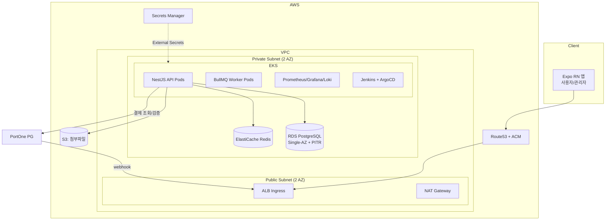

# LUNOTE 아키텍처 (확정본)

> 최종 확정: 2026-07-21. 이 문서가 기술 의사결정의 단일 기준(Single Source of Truth)이다.
> 변경이 필요하면 이 문서를 먼저 수정하고 코드를 바꾼다.

## 1. 서비스 개요

한국 거주/입국 예정 외국인을 위한 컨시어지 플랫폼. 실결제가 발생하는 상용 서비스로,
1인이 개발·운영하므로 자동화(IaC, GitOps)와 관측성을 통해 운영 부담을 최소화하는 것을
아키텍처의 제1원칙으로 한다.

**핵심 플로우**: 소셜 로그인 → 카테고리별 문의 등록(사진/파일 첨부) → 관리자 견적 발송 →
해외카드 결제(PortOne) → 상태 추적 (Reviewing → Paid → In Progress → Completed)

## 2. 확정 기술 스택

| 분류 | 선택 | 비고 |
|---|---|---|
| 모바일 앱 | React Native (Expo, EAS Build) | iOS/Android 동시 출시 |
| 백엔드 | **NestJS (TypeScript)** | 프론트와 언어 통일, 1인 운영 속도 최우선 |
| ORM | **Prisma** | 타입 안전 쿼리 + 마이그레이션 관리 |
| DB | AWS RDS PostgreSQL, Single-AZ + PITR(5분) | 파일은 S3 (presigned URL) |
| 큐/캐시 | **Redis + BullMQ** | 푸시 알림 발송, 웹훅 재처리 잡 |
| 인증 | Passport — Google/Apple OAuth **+ 이메일/비밀번호** + JWT | 비밀번호는 argon2 해싱, 재설정은 이메일 링크 방식 |
| 결제 | PortOne (해외카드/Apple Pay 허브) | 웹훅 서명 검증 + 멱등성 필수 |
| 컨테이너 오케스트레이션 | AWS EKS | 코어 노드그룹 On-Demand + 워커 Spot(Karpenter) |
| CI/CD | Jenkins(동적 에이전트 Pod) + ArgoCD | GitOps 무중단 배포 |
| IaC | Terraform | 콘솔 수동 조작 금지 |
| 관측성 | Prometheus + Grafana + Loki + Alertmanager | kube-prometheus-stack Helm 차트 |
| 시크릿 | AWS Secrets Manager + External Secrets Operator | 앱 Pod에는 IRSA로 최소권한 부여 |

## 3. 시스템 아키텍처



## 4. 네트워크 설계

- VPC 1개, 2개 AZ. 퍼블릭 서브넷에는 ALB와 NAT Gateway만 둔다.
- EKS 노드, RDS, Redis는 전부 프라이빗 서브넷. RDS는 인터넷에서 절대 직접 접근 불가.
- 보안그룹은 최소권한: `RDS SG ← EKS 노드 SG(5432)`, `Redis SG ← EKS 노드 SG(6379)`처럼
  SG 참조 방식으로만 연다. CIDR 전체 개방 금지.
- NAT Gateway는 비용 절감을 위해 초기 1개(단일 AZ)로 시작하고, 트래픽 성장 시 AZ별로 확장.
- DB 로컬 접근이 필요할 때는 SSM Session Manager 포트포워딩 사용 (Bastion EC2 두지 않음).

## 5. 시크릿 관리

- 모든 시크릿(DB 비밀번호, PortOne API Secret, OAuth 클라이언트 시크릿, JWT 서명키)은
  **AWS Secrets Manager**에 저장하고 Terraform으로 리소스만 생성(값은 수동/CLI 주입).
- EKS에는 **External Secrets Operator**를 설치해 Secrets Manager → K8s Secret 동기화.
- Pod의 AWS 권한은 **IRSA**(IAM Roles for Service Accounts)로 부여. 노드 롤에 권한 몰아주기 금지.
- **시크릿은 어떤 형태로든 git에 커밋하지 않는다.** `.env`는 로컬 개발 전용이며 `.gitignore` 대상.

## 6. Terraform 상태 관리

- 원격 백엔드: **S3 버킷** (버저닝 + SSE 암호화 활성화), `use_lockfile = true`로 S3 네이티브 잠금 사용.
- 환경 분리는 디렉토리 방식: `infra/terraform/envs/prod` (필요시 `staging` 추가).
- 공용 모듈은 `infra/terraform/modules/` (vpc, eks, rds, s3, iam 등).
- state 버킷과 잠금 설정 자체는 최초 1회 부트스트랩 스택으로 생성.

## 7. 결제 흐름과 웹훅 멱등성

```
사용자 결제 → PortOne → (1) 앱 콜백  (2) 서버 웹훅  ← 진실의 원천은 웹훅
```

- 앱 콜백은 UX용일 뿐, **결제 확정은 반드시 서버 웹훅 + PortOne 결제조회 API 교차검증**으로만 한다.
- 웹훅 처리 규칙:
  1. 서명(시그니처) 검증 실패 시 즉시 401 거부.
  2. `payment_events` 테이블에 PortOne 이벤트 ID를 **UNIQUE 제약**으로 저장 —
     중복 웹훅은 INSERT 충돌로 감지하고 200으로 무시 (멱등성).
  3. 결제 상태 전이는 DB 트랜잭션 안에서: 이벤트 기록 → PortOne API로 금액/통화 재검증 →
     주문 상태 변경 → 커밋. 금액 불일치 시 상태 변경 없이 알림만 발송.
  4. 처리 실패 시 5xx를 반환해 PortOne 재전송을 유도하고, BullMQ로 자체 재처리 잡도 등록.
- 주문 상태 머신: `REVIEWING → QUOTED → PAID → IN_PROGRESS → COMPLETED` (+ `CANCELLED`, `REFUNDED`).
  허용되지 않은 전이는 서비스 레이어에서 거부.

## 8. 관측성 (Observability)

- **메트릭**: kube-prometheus-stack (Prometheus + Grafana + Alertmanager).
  NestJS는 `/metrics` 엔드포인트 노출 (prom-client).
- **로그**: Loki + Promtail. 앱 로그는 JSON 구조화 로그(pino)로 출력.
- **핵심 알림 (Alertmanager → 텔레그램 또는 Slack)**:
  - API 5xx 비율 > 1% (5분), P95 지연 > 1s
  - 웹훅 처리 실패, 결제 금액 불일치 감지 (비즈니스 알림)
  - Pod CrashLoopBackOff, 노드 NotReady, RDS 스토리지/커넥션 임계치
- 대시보드: ① 서비스(요청량/에러/지연) ② 비즈니스(결제 성공률, 문의→결제 전환) ③ 인프라(노드/DB).

## 9. CI/CD 파이프라인

```
git push → Jenkins (동적 에이전트 Pod: lint/test/build → ECR push)
        → 매니페스트 레포의 이미지 태그 업데이트 (커밋)
        → ArgoCD가 감지 → EKS에 동기화 (RollingUpdate 무중단)
```

- 앱 코드 레포와 K8s 매니페스트(GitOps) 디렉토리를 분리: `infra/k8s/`가 ArgoCD의 소스.
- Jenkins 에이전트는 상시 띄우지 않고 빌드 시에만 Pod로 생성 (Kubernetes 플러그인).
- 이미지 태그는 git SHA 기반. `latest` 태그 사용 금지 (롤백 가능성 확보).

## 10. 비용 전략

- 워커 노드: Karpenter + Spot. 코어 노드그룹(On-Demand 소형)에는 CoreDNS, ArgoCD 등 필수 컴포넌트만.
- 예상 월 비용 $150~250 (EKS $73 + 노드 + NAT + RDS + ALB). 매출 발생 전 고정비이므로 월 단위로 실측·기록한다.
- 전체 스택은 Terraform만으로 재현 가능해야 한다 — 리전 장애 등 최악의 상황에서 RDS 백업 + `terraform apply`로 복구하는 것이 DR 전략의 기본이다.

## 11. 로드맵

백엔드/인프라 트랙과 앱(Expo) 트랙을 병행한다. 앱은 백엔드 API 계약이 잡히는 대로
화면을 붙여나가며, 백엔드의 TypeScript 타입(DTO)을 공유해 재작업을 방지한다.

**트랙 A — 백엔드 & 인프라**

| Phase | 내용 | 완료 기준 |
|---|---|---|
| **A1. 백엔드 코어** | NestJS + Prisma + Docker Compose 로컬 환경. 인증, 문의/견적/주문 도메인, PortOne 웹훅(멱등성 포함) | 로컬에서 전체 플로우 E2E 동작 + 테스트 |
| **A2. 기반 인프라** | Terraform: state 부트스트랩 → VPC → RDS/Redis/S3/ECR → EKS + Karpenter | `terraform apply`만으로 전체 재현 |
| **A3. 배포 파이프라인** | 수동 배포로 검증 → Jenkins + ArgoCD 구축, External Secrets, ALB Ingress + 도메인/TLS | push→자동 배포 무중단 동작 |
| **A4. 운영 준비** | 관측성 스택 + 알림, 부하 테스트, PortOne 실연동 심사 | 알림 받고 대응 가능한 상태 |

**트랙 B — 앱 (Expo)** — A1 시작 직후부터 병행

| Phase | 내용 | 완료 기준 |
|---|---|---|
| **B1. 앱 뼈대** | Expo 프로젝트 셋업, 내비게이션 구조(Figma 기반), 디자인 토큰, 소셜 로그인 화면 | 로그인 → 홈 진입 동작 |
| **B2. 핵심 플로우** | 문의 등록(사진/파일 업로드), 견적 확인, PortOne 결제 화면, 상태 추적 | 로컬 백엔드 대상 전체 플로우 동작 |
| **B3. 관리자 & 마감** | 관리자 화면(문의 처리, 견적 발송, 대시보드), 푸시 알림, 다국어(i18n) | 실 API 대상 E2E 완료 |
| **B4. 출시** | EAS 프로덕션 빌드, 스토어 심사 대응 | App Store / Play Store 출시 |

순서 규칙: A1이 첫 삽 (앱이 붙을 API 계약이 먼저). 인프라(A2~A4)는 A1이 동작한 뒤.
B4(출시)는 A4(운영 준비) 완료가 선행 조건 — 알림/대응 체계 없이 실결제 서비스를 열지 않는다.
