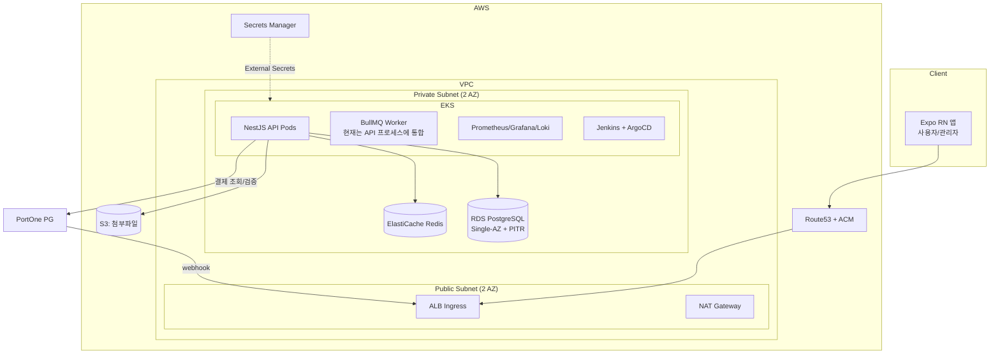

# LUNOTE 아키텍처 (확정본)

> 최종 확정: 2026-07-21. 이 문서가 기술 의사결정의 단일 기준(Single Source of Truth)이다.
> 변경이 필요하면 이 문서를 먼저 수정하고 코드를 바꾼다.

## 1. 서비스 개요

한국 거주/입국 예정 외국인을 위한 컨시어지 플랫폼. 실결제가 발생하는 상용 서비스로,
1인이 개발·운영하므로 자동화(IaC, GitOps)와 관측성을 통해 운영 부담을 최소화하는 것을
아키텍처의 제1원칙으로 한다.

**핵심 플로우**: 소셜 로그인 → 카테고리별 문의 등록(사진/파일 첨부) → 관리자 견적 발송 →
해외카드 결제(PortOne) → 상태 추적 (Reviewing → Paid → In Progress → Completed)

## 2. 확정 기술 스택

| 분류 | 선택 | 비고 |
|---|---|---|
| 모바일 앱 | React Native (Expo SDK 57) | iOS/Android 동시 출시. Expo Go 불가 — 개발 빌드 사용 |
| 관리자 웹 | **Vite + React SPA** (`apps/admin-web`) | 내부 운영 도구. SSR 불필요 → 정적 빌드(S3/CloudFront 또는 nginx 컨테이너)로 배포 단순화. 기존 관리자 API(JWT + RolesGuard)만 소비, 백엔드 변경 없음 |
| 백엔드 | **NestJS (TypeScript)** | 프론트와 언어 통일, 1인 운영 속도 최우선 |
| ORM | **Prisma** | 타입 안전 쿼리 + 마이그레이션 관리 |
| DB | AWS RDS PostgreSQL, **Single-AZ** + PITR(5분) | 파일은 S3 (presigned URL). 2026-10-04 결정: 출시 후에도 Single-AZ 유지, **누적 실결제 10건 도달 시 Multi-AZ 전환**(속성 하나, 온라인 변경). 유실 위험은 PITR로 동일, 잃는 건 장애 시 자동 페일오버뿐 |
| 큐/캐시 | **Redis + BullMQ** | 푸시 알림 발송, 웹훅 재처리 잡 |
| 인증 | Passport — Google/Apple OAuth **+ 이메일/비밀번호** + JWT | 비밀번호는 argon2 해싱, 재설정은 이메일 링크 방식 |
| 결제 | PortOne (페이팔 SPB) + 수동 계좌이체 | 웹훅 서명 검증 + 멱등성 필수, 계좌이체는 관리자 확인 흐름 |
| 컨테이너 오케스트레이션 | AWS EKS | 코어 노드그룹 On-Demand + 워커 Spot(Karpenter) |
| CI/CD | Jenkins(동적 에이전트 Pod) + ArgoCD, PR 검사는 GitHub Actions | GitOps 무중단 배포. PR 검사에는 배포 권한이 없다 |
| IaC | Terraform | 콘솔 수동 조작 금지 |
| 관측성 | Prometheus + Grafana + Loki + Alertmanager | kube-prometheus-stack Helm 차트 |
| 시크릿 | AWS Secrets Manager + External Secrets Operator | 앱 Pod에는 IRSA로 최소권한 부여 |

## 3. 시스템 아키텍처


```mermaid
graph TB
    subgraph Client
        APP[Expo RN 앱<br/>사용자/관리자]
    end
    subgraph AWS
        R53[Route53 + ACM] --> ALB[ALB Ingress]
        subgraph VPC
            subgraph "Public Subnet (2 AZ)"
                ALB
                NAT[NAT Gateway]
            end
            subgraph "Private Subnet (2 AZ)"
                subgraph EKS
                    API[NestJS API Pods]
                    WORKER[BullMQ Worker<br/>현재는 API 프로세스에 통합]
                    OBS[Prometheus/Grafana/Loki]
                    CICD[Jenkins + ArgoCD]
                end
                RDS[(RDS PostgreSQL<br/>Single-AZ + PITR)]
                REDIS[(ElastiCache Redis)]
            end
        end
        S3[(S3: 첨부파일)]
        SM[Secrets Manager]
    end
    PORTONE[PortOne PG]
    APP --> R53
    API --> RDS & REDIS & S3
    PORTONE -- webhook --> ALB
    API -- 결제 조회/검증 --> PORTONE
    SM -. External Secrets .-> EKS
```

## 4. 네트워크 설계

- VPC 1개, 2개 AZ. 퍼블릭 서브넷에는 ALB와 NAT Gateway만 둔다.
- EKS 노드, RDS, Redis는 전부 프라이빗 서브넷. RDS는 인터넷에서 절대 직접 접근 불가.
- 보안그룹은 최소권한: `RDS SG ← EKS 노드 SG(5432)`, `Redis SG ← EKS 노드 SG(6379)`처럼
  SG 참조 방식으로만 연다. CIDR 전체 개방 금지.
- NAT Gateway는 비용 절감을 위해 초기 1개(단일 AZ)로 시작하고, 트래픽 성장 시 AZ별로 확장.
- DB 로컬 접근이 필요할 때는 SSM Session Manager 포트포워딩 사용 (Bastion EC2 두지 않음).

## 5. 시크릿 관리

- 모든 시크릿(DB 비밀번호, PortOne API Secret, OAuth 클라이언트 시크릿, JWT 서명키)은
  **AWS Secrets Manager**에 저장하고 Terraform으로 리소스만 생성(값은 수동/CLI 주입).
- EKS에는 **External Secrets Operator**를 설치해 Secrets Manager → K8s Secret 동기화.
- Pod의 AWS 권한은 **IRSA**(IAM Roles for Service Accounts)로 부여. 노드 롤에 권한 몰아주기 금지.
- **시크릿은 어떤 형태로든 git에 커밋하지 않는다.** `.env`는 로컬 개발 전용이며 `.gitignore` 대상.
  추가 방어선으로 `.githooks/pre-commit`이 시크릿 파일(.env/.pem/.key/.tfvars)과
  시크릿 패턴(AWS 액세스 키, 개인키 헤더, 긴 SECRET 값)을 커밋 단계에서 차단한다.
  로컬 `.env`는 권한 600으로 제한한다.
- **JWT는 암호화가 아니라 서명이다.** 페이로드는 base64로 누구나 읽을 수 있으므로
  사용자 ID와 role 외의 개인정보를 넣지 않는다. 서명키(JWT_SECRET)가 유출되면
  임의 사용자로 위장 가능하므로 프로덕션 값은 Secrets Manager에서만 관리하고
  환경별로 다른 값을 쓴다.

## 6. Terraform 상태 관리

- 원격 백엔드: **S3 버킷** (버저닝 + SSE 암호화 활성화), `use_lockfile = true`로 S3 네이티브 잠금 사용.
- 환경 분리는 디렉토리 방식: `infra/terraform/envs/prod` (필요시 `staging` 추가).
- 공용 모듈은 `infra/terraform/modules/` (vpc, eks, rds, s3, iam 등).
- state 버킷과 잠금 설정 자체는 최초 1회 부트스트랩 스택으로 생성.

## 7. 결제 흐름과 웹훅 멱등성

```
사용자 결제 → PortOne → (1) 앱 콜백  (2) 서버 웹훅  ← 진실의 원천은 웹훅
```

- 앱 콜백은 UX용일 뿐, **결제 확정은 반드시 서버 웹훅 + PortOne 결제조회 API 교차검증**으로만 한다.
- 웹훅 처리 규칙:
  1. 서명(시그니처) 검증 실패 시 즉시 401 거부.
  2. `payment_events` 테이블에 PortOne 이벤트 ID를 **UNIQUE 제약**으로 저장 —
     중복 웹훅은 INSERT 충돌로 감지하고 200으로 무시 (멱등성).
  3. 결제 상태 전이는 DB 트랜잭션 안에서: 이벤트 기록 → PortOne API로 금액/통화 재검증 →
     주문 상태 변경 → 커밋. 금액 불일치 시 상태 변경 없이 알림만 발송.
  4. 처리 실패 시 5xx를 반환해 PortOne 재전송을 유도하고, BullMQ로 자체 재처리 잡도 등록.
- 주문 상태 머신: `REVIEWING → QUOTED → PAID → IN_PROGRESS → COMPLETED` (+ `CANCELLED`, `REFUNDED`).
  허용되지 않은 전이는 서비스 레이어에서 거부.
- **PG 전략 (2026-09-07 확정, 2026-09-23 개정)**: 1차 출시는 **페이팔(PortOne V2, SPB 일반결제)과
  수동 계좌이체(법인계좌)** 두 가지. 페이팔은 심사 없이 즉시 개통되고 무형 서비스 업종 제한이 없기 때문.
  국내 카드(KG이니시스)는 가계약을 진행하지 않고 소멸시킨다(2026-09-23) —
  국내 카드 수요가 지표로 입증되면 재신청한다(가계약→카드사 심사 리드타임 2~3주).
  엑심베이(해외카드 직접·Apple Pay)는 매출 검증 후 검토.
  - 페이팔은 판매자·구매자가 모두 한국 계정이면 결제 불가 — **해외 결제수단 보유자(입국 전/직후) 전용**이다.
    한국 계좌를 보유한 정착 외국인은 계좌이체가 커버한다.
  - **수동 계좌이체 (2026-09-23 확정)**: KRW 견적은 INICIS 도입 전까지 BANK_TRANSFER로 라우팅.
    PG 파이프라인(웹훅+교차검증) 밖의 별도 흐름: `입금 대기 → 관리자 입금 확인 → PAID`,
    기한 내 미입금 시 자동 만료. 주문번호 기반 입금코드를 입금자명에 입력하게 해 매칭한다
    (입금자명·금액 불일치는 관리자 확인으로 마감). 환불은 수동 이체,
    현금영수증은 소비자 요청 시 홈택스 수동 발급. 입금 확인 자동화(가상계좌)는 국내 PG 재신청 시점에.
  - 페이팔은 KRW를 받지 못하므로 **견적·결제 통화는 USD**로 확정한다.
    `Payment.provider`(PAYPAL / 추후 INICIS)는 견적 통화로 라우팅한다 (USD→PAYPAL, KRW→INICIS).
    앱은 provider에 따라 결제 UI 컴포넌트를 분기한다 (페이팔=`PaymentUI` 버튼 렌더링, 국내 PG=`Payment` 결제창).
  - PortOne `totalAmount`는 통화 최소 단위 정수(USD 센트)다. 변환은 서버 `payments/currency.ts` 한 곳에서만.
  - 결제 의도(`POST /payments`)는 `quoteId`만 받는다 — 금액/통화의 원천은 서버의 Quote.
    응답에는 storeId/channelKey(공개 식별자)만 나가고 API Secret·웹훅 시크릿은 서버 밖으로 나가지 않는다.
  - 앱 콜백 후 `POST /payments/:id/confirm`은 웹훅과 **같은 전이 함수**를 호출한다
    (앱 결과는 신뢰하지 않고 PortOne 조회 API로 재검증). 상태 조건을 `updateMany`의 where에 넣어
    웹훅·confirm이 동시에 와도 전이는 한 번만 일어난다.
  - 같은 견적에 PAID 결제가 2건 생기는 것은 DB 부분 유니크 인덱스(`payments_one_paid_per_quote`)가 막는다.
  - 취소/환불은 PortOne 콘솔에서 실행하고 `Transaction.Cancelled` 웹훅으로 REFUNDED를 반영한다
    (관리자 환불 API는 필요가 입증될 때 추가).
  - PortOne 외부 호출은 `PortOneGateway` 한 클래스로만 나간다 — e2e는 이 클래스를 가짜로 바꿔
    실 API 없이 서명 검증·불일치·중복·환불 시나리오를 검증한다.
- **견적 정책 (2026-07-24 확정)**: 견적은 발행 후 **불변** — 수정 API를 두지 않는다
  (관리자 임의 변경으로 인한 분쟁 방지). `Quote.expiresAt = 발행 + 7일`,
  만료된 견적으로는 결제할 수 없다. 관리자 행위(견적 발행 등)는 감사 로그 테이블에 기록한다.
- **알림 전달 보장 (2026-07-24 확정)**: 인앱 알림 행 생성은 유발 이벤트와 **같은 DB
  트랜잭션**에서 수행한다(DB-first — Redis 장애와 무관하게 유실 불가).
  BullMQ 큐는 이메일 등 외부 부수효과 전용 (재시도 3회, 최종 실패 허용).

## 8. 관측성 (Observability)

- **메트릭**: kube-prometheus-stack (Prometheus + Grafana + Alertmanager).
  NestJS는 `/metrics` 엔드포인트 노출 (prom-client).
- **로그**: Loki + Promtail. 앱 로그는 JSON 구조화 로그(pino)로 출력.
- **핵심 알림 (Alertmanager → 텔레그램 또는 Slack)**:
  - API 5xx 비율 > 1% (5분), P95 지연 > 1s
  - 웹훅 처리 실패, 결제 금액 불일치 감지 (비즈니스 알림)
  - Pod CrashLoopBackOff, 노드 NotReady, RDS 스토리지/커넥션 임계치
- 대시보드: ① 서비스(요청량/에러/지연) ② 비즈니스(결제 성공률, 문의→결제 전환) ③ 인프라(노드/DB).
- **앱 계측 (2026-07-24 확정)**: `nestjs-pino`로 JSON 구조화 로그 + 요청별 request-id +
  민감 필드 redaction. 에러 트래킹은 **Sentry**(무료 티어) — 1인 운영에서 장애 인지의 최소 장치.

## 9. CI/CD 파이프라인

```
PR(develop·main 대상) → GitHub Actions: 세 앱 lint·타입 검사 + api 단위 테스트 (시크릿·배포 권한 없음)
develop push → GitHub 웹훅 → Jenkins (웹훅 경로만 공개: GitHub 발신 IP + HMAC 서명 검증)
  → 에이전트 Pod(Spot): lint → test → e2e → BuildKit rootless 빌드 → Trivy 스캔 → ECR push (git SHA)
  → 배포 저장소(So1ky/lunote-deploy)에 커밋: 그 커밋의 workloads/api 매니페스트 + newTag (deploy key)
  → ArgoCD가 감지 → EKS에 동기화 (RollingUpdate 무중단)
prod 승격 = overlays/prod의 SHA 두 줄(base ref + newTag) 변경 PR → 사람이 머지 → ArgoCD(api-prod)가 동기화.
롤백 = staging은 배포 저장소의 그 커밋 revert, prod는 승격 PR revert.
```

- 앱 코드 레포와 K8s 매니페스트(GitOps) 디렉토리를 분리: `infra/k8s/`가 ArgoCD의 소스.
- Jenkins는 git에 태그 커밋만 남기고 배포는 ArgoCD만 한다. Jenkins에는 클러스터 자격 증명이 없다. 단, deploy key는
  ArgoCD를 거치는 **간접 배포 권한**이다 — 그래서 키는 외부 코드(npm 의존성, Dockerfile)가
  돌지 않는 전용 최소 Pod에서만 쓰고, 빌드 Pod에는 내려보내지 않는다. ECR 권한(IRSA)도 빌드 Pod의 aws 컨테이너에만.
- **deploy key가 닿는 범위 = staging 네임스페이스 (2026-10-05 결정)**: CI의 deploy key는 배포 전용 저장소
  `So1ky/lunote-deploy`(public, Actions 끔)에만 등록한다 — 이 저장소(앱·플랫폼 매니페스트)에는 쓸 수 없다.
  CI는 빌드한 커밋의 `infra/k8s/workloads/api`를 배포 저장소에 통째로 복사하고 `newTag`만 바꿔 커밋한다(병합 없음,
  매니페스트만 바뀐 커밋은 이미지 태그를 유지한 채 옮긴다). 이 저장소의 `newTag`는 자리표시다. 울타리는 세 겹:
  ① `api-staging` 앱만 배포 저장소를 보며 AppProject `staging-api`(staging 네임스페이스, 오버레이가 만드는 리소스
  종류만, 클러스터 범위 금지)에 묶인다. `root`와 플랫폼 앱은 develop(PR 필수 + PR 검사 3종 필수)을 본다.
  ② staging 네임스페이스는 Pod Security `restricted` — 프로젝트는 리소스의 종류만 막고 Pod의 내용(hostPath,
  privileged)은 못 막기 때문이다. ③ staging API의 Service와 Ingress는 배포 저장소가 아니라 `namespaces` 앱에 두고
  프로젝트 허용 목록에서 뺀다 — Service의 `externalIPs`(다른 네임스페이스의 트래픽 가로채기)·type=LoadBalancer,
  Ingress의 공유 ALB 규칙으로 네임스페이스 밖에 닿을 수 없게. 같은 저장소의 배포 브랜치 방식은 버렸다: 그 브랜치에
  워크플로 파일을 넣으면 GitHub Actions가 실행돼 저장소 쓰기 토큰을 얻는다.
  **prod 앱은 CI 키로 쓸 수 있는 저장소를 읽지 않는다** — prod 승격은 사람이 머지하는 PR로만 한다(CI가 배포 저장소에
  복사하는 `workloads/api`에 prod 오버레이가 섞여 있어도 prod 앱의 소스가 아니다).
  남는 위험: staging 안에서는 (restricted 범위의) 임의 워크로드를 띄울 수 있고 staging 시크릿에 닿는다.
  Jenkins 컨트롤러가 탈취되면 키는 여전히 샌다 — 줄어든 것은 키로 할 수 있는 일의 범위다.
  **2026-10-06 보강(#128 일부, prod 구축 전)**: ① staging·prod의 Pod는 Karpenter 노드에만 뜬다 —
  ValidatingAdmissionPolicy가 `nodeName` 직접 지정을 막고 `karpenter.sh/nodepool: default` nodeSelector를 요구하며,
  PriorityClass는 자기 환경 것만 허용한다(코어 노드의 플랫폼 Pod를 압박하던 경로). ② Service `externalIPs`는 클러스터
  전역에서 금지. ③ IngressClass `alb`는 그룹 `lunote`·허용 네임스페이스(staging·prod·jenkins)로 고정. ④ prod
  네임스페이스도 Pod Security `restricted`. ⑤ 공용 Redis 분리 — staging은 클러스터 내 Redis, ElastiCache와 그
  시크릿은 prod 전용(§12). #128에 남긴 것: argocd repo-server NetworkPolicy, ArgoCD sync impersonation,
  jenkins·argocd 네임스페이스의 Pod Security 등급.
- **prod는 base를 커밋 SHA로 고정한다 (2026-10-06 결정)**: `api-prod` 앱은 이 저장소 develop의
  `workloads/api/overlays/prod`를 자동 동기화하지만, 오버레이는 base를 로컬 경로가 아니라
  `https://github.com/So1ky/LUNOTE//infra/k8s/workloads/api/base?ref=<커밋 SHA>`로 가져온다. base는 staging과
  공유하므로 로컬 경로로 참조하면 base 변경이 staging 검증 전에 prod에 바로 들어간다. 승격 PR은 두 줄을 바꾼다 —
  base ref(매니페스트를 가져올 커밋)와 `newTag`(이미지). 값은 배포 저장소 최신 커밋(staging이 실제로 돌린 것)에서
  읽는다. 매니페스트만 바뀐 커밋은 이미지를 다시 만들지 않으므로 두 SHA는 다를 수 있다. 이미지는 다시 빌드하지 않는다.
  prod 전용 설정(오버레이의 설정값·HPA·PDB·패치)은 SHA 고정 대상이 아니다 — 머지 즉시 prod에 반영된다.
  main 브랜치 추적(승격마다 PR 2개, main 보호 규칙 정비 필요)과 수동 Sync(PR 머지가 승인이 아니게 됨)는 버렸다.
- Jenkins 에이전트는 상시 띄우지 않고 빌드 시에만 Pod로 생성 (Kubernetes 플러그인).
- `apps/api/`가 바뀐 커밋만 이미지를 만든다. fork PR은 빌드하지 않는다(public 저장소).
- **PR 검사는 GitHub Actions (2026-10-05 결정)**: public 저장소라 fork PR의 코드를 Jenkins 빌드 Pod(ECR 권한)에서
  실행하지 않는다. Actions는 fork PR을 시크릿 없이 격리 실행한다. 역할 분리 — PR 검사 = Actions(`contents: read`만),
  배포 파이프라인 = Jenkins + ArgoCD. `pull_request_target`은 쓰지 않는다.
- Actions의 서드파티 액션은 태그가 아니라 **커밋 SHA로 고정**한다(태그는 변조될 수 있다 — 2026-03 trivy-action 사고).
- 이미지 태그는 git SHA 기반. `latest` 태그 사용 금지 (롤백 가능성 확보).
- **스캔한 이미지 = 올리는 이미지**: BuildKit이 OCI 레이아웃으로 한 번만 빌드하고, Trivy가 그 산출물을 스캔하고,
  crane이 같은 산출물을 변환 없이 ECR에 올린다(다시 빌드하지 않는다). push는 빌드 직후 기록한 매니페스트
  다이제스트를 지정해서 하고(내용이 다르면 레지스트리가 거부) 태그는 그 다이제스트에만 붙인다. 산출물은 빌드·스캔·push
  컨테이너만 보는 볼륨에 둔다. 한계: 빌드 컨텍스트(`apps/api`)는 테스트가 돈 작업 폴더라, 같은 Pod의 외부 코드에 대한
  보안 경계는 아니다 — 그 분리는 빌드를 깨끗한 체크아웃의 별도 Pod로 옮겨야 한다.

## 10. 비용 전략

- 워커 노드: Karpenter + Spot. 코어 노드그룹(On-Demand 소형)에는 CoreDNS, ArgoCD 등 필수 컴포넌트만.
- 예상 월 비용 $150~250 (EKS $73 + 노드 + NAT + RDS + ALB). 매출 발생 전 고정비이므로 월 단위로 실측·기록한다.
- **(2026-09-29) 데이터 계층 구축분**: RDS Multi-AZ db.t4g.micro ≈$38 + gp3 스토리지 ≈$5 +
  Redis cache.t4g.micro ≈$15 ≈ 합계 **$58/월** (청구서 실측 전 추정치). S3/ECR은 종량, 바스천은 검증 시간만 과금.
- **(2026-10-04) RDS Single-AZ 전환**: 비용 재검토로 Multi-AZ 해제 (≈-$20/월, 데이터 계층 ≈$38/월).
  누적 실결제 10건 도달 시 `multi_az = true` 복원 (§12 가용성 방침).
- **(2026-10-04) EKS 구축분**: 컨트롤플레인 $73 + NAT 재개 ≈$44 + 코어 노드 t4g.medium×1 ≈$30 +
  EBS·KMS ≈$3 ≈ **$150/월** (추정치). Spot 노드는 워크로드가 있을 때만 과금. 전체 합계 ≈$190/월.
- **(2026-10-06) prod 워크로드**: API Pod 2개를 서로 다른 노드에 두기 위한 Spot 노드 1대 ≈ +$10~15/월(추정치).
  metrics-server·staging Redis는 기존 노드에 얹어 추가 비용 없음.
- 전체 스택은 Terraform만으로 재현 가능해야 한다 — 리전 장애 등 최악의 상황에서 RDS 백업 + `terraform apply`로 복구하는 것이 DR 전략의 기본이다.

## 11. 보안 체크리스트

시크릿 관리(§5)는 보안의 일부일 뿐이다. 실결제 서비스로서 갖춰야 할 항목을 단계별로 관리한다.

### 애플리케이션

- [x] 비밀번호 argon2 해싱 (원문 미저장)
- [x] 로그인 실패 시 계정 존재 여부 비노출 (모두 401)
- [x] 가입 이메일 인증 (6자리 코드, 해시 저장, 15분 만료, 시도 5회 제한) — 미인증 시 문의/업로드 차단
- [x] 입력 검증: 전역 ValidationPipe (whitelist + forbidNonWhitelisted)
- [x] SQL 인젝션: Prisma 파라미터 바인딩 (raw 쿼리 사용 시 반드시 `$queryRaw` 태그드 템플릿)
- [x] JWT 페이로드에 개인정보 미포함 (§5)
- [x] rate limiting — 로그인/가입은 강하게, 전역은 완만하게
- [x] 보안 HTTP 헤더 (helmet), CORS 허용 출처 명시
- [x] **리소스 소유권 검증(IDOR 방지)** — 문의 API에 적용 완료 (타인 접근 404, e2e 검증). 견적/결제 API에도 동일 패턴 적용 예정
- [ ] 파일 업로드: S3 presigned URL, 용량/MIME 제한, 실행 가능 확장자 차단
      — 용량 제한은 presigned POST의 `content-length-range` 조건으로 서버가 강제한다
- [ ] 토큰 무효화 — **refresh token rotation으로 확정(2026-07-24)**: 액세스 30분 +
      리프레시 30일, 리프레시는 해시로 DB 저장·사용 시마다 회전·재사용 탐지 시 세션 전체 폐기
- [x] 관리자 API에 role 기반 가드 (RolesGuard) — admin 견적 API 적용, e2e 검증

### 결제 (§7과 연동)

- [x] 웹훅 서명 검증 + 이벤트ID UNIQUE 멱등성 (구현·e2e 검증 완료 — `payments.e2e-spec.ts`)
- [x] 결제 확정 전 PortOne 조회 API로 금액/통화 교차검증 (`PaymentsService.applyRemote`)
- [x] **카드 정보는 어떤 형태로도 저장하지 않는다** — PortOne이 처리 (PCI-DSS 범위 회피).
      Payment 행에는 금액·통화·상태·PortOne 거래번호만 있다
- [x] 금액 불일치 감지 시 상태 변경 없이 알림 발송 (관리자 인앱 알림 + Sentry)
- [ ] 프로덕션 웹훅 URL 등록 + PortOne 발신 IP(52.78.5.241) 허용 검토 (A4)

### 인프라 (A2~A4)

- [x] RDS 저장 시 암호화(KMS), S3 SSE + 퍼블릭 액세스 차단 — RDS는 aws/rds 관리형 키,
      첨부 S3(staging/prod 2개)는 SSE-S3 + 퍼블릭 전면 차단 (2026-09-29, `infra/terraform/modules/rds`, `s3`)
- [x] 전 구간 TLS (ACM + ALB), HSTS — ALB가 80→443 리다이렉트·TLS 1.2+ 정책, API가 HSTS 헤더, RDS는 CA 검증,
      Redis는 TLS(prod ElastiCache) (2026-10-06 prod 확인)
- [x] RDS/Redis 프라이빗 서브넷, 보안그룹 SG 참조 최소권한 (§4) — RDS Single-AZ(db.t4g.micro, §12) +
      Redis 7.1(TLS+AUTH, cache.t4g.micro)까지 SG 참조 인그레스로 구축 완료. ECR(`lunote/api`)은
      IMMUTABLE 태그로 latest 금지 규칙을 레지스트리 단에서 강제 (2026-09-29, `infra/terraform/modules/{rds,elasticache,ecr}`)
- [x] K8s: 비root 컨테이너, RBAC 최소권한, NetworkPolicy (2026-10-04 staging 적용 — 워크로드 SA는 K8s API 권한 없음)
- [x] 이미지 취약점 스캔 — CI가 Trivy(HIGH/CRITICAL, 수정본 있는 것만)로 차단, `npm audit`은 경고 (2026-10-05 Phase 4).
      한계: `apps/api` 변경이 있는 커밋만 스캔한다 — 배포된 이미지의 신규 CVE는 잡지 못한다(2026-10-06 proxy-addr 사례), 주기 스캔은 Phase 5-2 후보
- [ ] 감사 로그: 결제 상태 전이·관리자 행위 기록 (분쟁 대응 근거)

### 법적 요구사항 (출시 전 필수)

- [ ] **개인정보보호법(PIPA)**: 개인정보 처리방침 게시, 수집·이용 동의 절차,
      보유기간·파기 정책, 개인정보 암호화 저장
- [ ] 앱스토어 심사용 개인정보 처리방침 URL, 데이터 수집 항목 신고
- [ ] **앱 내 계정 삭제 기능** (App Store 5.1.1 필수) — 미구현 시 리젝.
      비활성 소셜 로그인 버튼도 심사 전 구현 또는 제거 (미완성 UI 리젝 사유)
- [ ] 외국인 이용자 대상이므로 처리방침 영문 제공

## 12. 확정된 식별자·환경 결정 (구 미결정 사항)

- **도메인 `lunoteapp.com` / 번들 식별자 `com.lunoteapp` 확정 (2026-09-22)** — iOS/Android 동일.
  App Store 최초 등록 후 변경 불가하므로 등록 시 이 값 사용.
  (`app.json`의 임시값 `app.lunote`는 스토어 등록 전에 교체 — 교체 시 개발 빌드 재빌드 필요.)
- **환경 분리 (2026-09-17)**: EKS 클러스터 1개 + `staging`/`prod` 네임스페이스 분리.
  근거·완화책은 배포 설계 스펙(`docs/superpowers/specs/` — 로컬 전용, git 추적 제외) §0.
- **EKS 구성 (2026-10-04 구축)**: 클러스터 `lunote`, K8s **1.36**(Karpenter 1.14 지원 상한에 맞춤),
  코어 노드그룹 AL2023 arm64 `t4g.medium` 1대(min 1/max 2, taint 없음), vpc-cni prefix delegation,
  EBS CSI + gp3 기본 StorageClass. Karpenter NodePool `default`는 Spot 우선(on-demand 폴백)·arm64 전용·
  c/m/r 5세대+·한도 16 vCPU/32Gi. 권한은 전부 IRSA(Karpenter·LBC·EBS CSI).
  **책임 분리**: Terraform은 AWS 리소스만(`infra/terraform`), 클러스터 내부(Karpenter 1.14.1·AWS Load
  Balancer Controller 3.5.0 차트, NodePool)는 `infra/k8s/platform/`의 커밋 파일을 ArgoCD가 관리(아래).
  플랫폼 컴포넌트는 `karpenter.sh/nodepool DoesNotExist` affinity로 코어 노드에 고정.
- **GitOps·시크릿 (2026-10-04 구축)**: ArgoCD 3.5(차트 10.9.6) **App of Apps** — 루트
  (`infra/k8s/bootstrap/root-app.yaml`)가 `infra/k8s/apps/`를 감시하고, 플랫폼 컴포넌트 전부(ArgoCD 자신,
  Karpenter, LBC, ESO, StorageClass, 환경 네임스페이스)를 `develop` 브랜치 기준으로 동기화한다.
  automated + selfHeal, **자동 prune은 끔**(실수로 지운 파일이 NodePool 삭제로 이어지지 않게).
  비HA 최소 구성(dex·notifications 없음), 외부 노출 없이 port-forward 접속.
  External Secrets Operator 2.11.0: 컨트롤러에는 AWS 권한이 없고, 환경 네임스페이스의 SA `eso-reader`가
  **환경별 IRSA 롤**(`lunote-eso-{staging,prod}` — `lunote/<env>/*` + `lunote/shared/redis` 읽기 전용)을
  맡는다. 네임스페이스 `SecretStore`만 쓰므로 staging에서 prod 시크릿은 읽을 수 없다(AccessDenied 검증).
  Redis 논리 DB: prod `/0`, staging `/1`. 코어 노드는 1대 유지(설치 후 메모리 requests ≈55%) —
  Jenkins 도입 시 실측으로 재확인(아래 CI 항목), Prometheus 도입 시 재측정.
- **staging 배포 (2026-10-04)**: `https://api-staging.lunoteapp.com`. 워크로드는
  `infra/k8s/workloads/api/`의 Kustomize base + `overlays/staging`(prod overlay는 prod 배포 때 추가),
  ArgoCD Application `api-staging`이 동기화한다(워크로드 앱은 prune 켬 — 해시 ConfigMap 정리).
  - **워커는 API 프로세스에 통합 유지**(결정 변경 — 기존 구상은 별도 Worker Deployment): 큐가 관리자
    이메일 전용이고 규모 가정이 ~50 MAU라 분리 이점이 작다. 큐 부하가 생기면 워커 진입점을 분리한다.
  - **배포 순서**: sync-wave로 ExternalSecret·설정(−2) → `prisma migrate deploy` Job(Sync hook, −1) →
    Deployment(0). 마이그레이션이 실패하면 롤아웃하지 않는다. PreSync hook은 같은 앱의 ExternalSecret보다
    먼저 실행돼 최초 배포에서 Secret이 없어 실패하므로 쓰지 않는다.
  - **배치**: 앱 파드는 Karpenter 노드에만(`nodeSelector karpenter.sh/nodepool: default`) — RDS/Redis
    인그레스가 참조하는 `lunote-app` SG는 Karpenter 노드에만 붙는다. 비root(uid 1000)·읽기 전용 루트·
    capabilities drop ALL. probe는 readiness만 `/health`, liveness는 TCP(DB 장애로 재시작 루프 방지).
  - **DB TLS**: node-postgres는 `sslmode=require`에서 인증서를 검증한다. RDS CA 번들을 ConfigMap으로
    마운트하고 `NODE_EXTRA_CA_CERTS`로 신뢰시킨다(검증을 끄지 않는다).
  - **Redis**: `REDIS_URL`의 스킴(rediss=TLS)·AUTH·경로(논리 DB)를 BullMQ 연결 옵션으로 변환.
  - **격리**: 네임스페이스별 ResourceQuota·LimitRange·NetworkPolicy 기본 거부(vpc-cni
    `enableNetworkPolicy`), PriorityClass(prod 1000 / staging 100). API에는 ALB 서브넷→3000, DNS,
    프라이빗 서브넷 5432/6379, 외부 443/587만 허용.
  - **진입**: ALB 1대를 staging/prod가 공유(Ingress group·이름 `lunote`), 서울 리전 `*.lunoteapp.com`
    ACM을 호스트명으로 자동 탐색, DNS는 Terraform이 ALB를 이름으로 조회해 alias. PortOne 웹훅 경로는
    `/payments/portone/webhook`(발신 IP allowlist는 미적용 — 서명 검증 + 조회 교차검증으로 방어).
  - **권한**: API IRSA 롤 `lunote-api-{staging,prod}` — 자기 환경 첨부 버킷의 객체 Put/Get만.
  - 첫 이미지는 로컬 수동 빌드(arm64, git SHA 태그). CI 자동화는 A3. 신규 비용 ≈$30/월(ALB + Spot 노드 1대).
- **CI (2026-10-05 결정)**: Jenkins(차트 5.9.65) 컨트롤러 1개를 코어 노드에 둔다. **코어 노드는 1대 유지** —
  실측(설치 전 노드 실사용 1447Mi/3.8GiB, 설치·빌드 후 가용 1341Mi)상 컨트롤러(requests 1Gi, limit 1.5Gi)가
  들어간다. 단 스케줄링 기준인 requests는 2964Mi/3288Mi(90%)라 남은 예약 여유는 ≈320Mi — 코어 노드에 컴포넌트를
  더 올리려면 증설이 먼저다. t4g는 가격이 메모리에
  정비례해 scale up(t4g.large)과 2대 증설의 비용이 같으므로(≈+$30/월) 증설은 Phase 5로 미룬다. 설정은 JCasC + Job DSL로 `infra/k8s/platform/jenkins/values.yaml`에 둔다.
  트리거는 **GitHub 웹훅** — 공유 ALB에 `ci-hooks.lunoteapp.com/github-webhook/` 규칙 하나만 열고(GitHub 발신
  IP 조건 + HMAC-SHA256 서명 검증), UI는 노출하지 않는다(port-forward). 빌더는 **BuildKit rootless**
  (기존 구상 Kaniko는 2025-06 아카이브). GitHub 쓰기는 deploy key(배포 저장소 `So1ky/lunote-deploy` 전용), ECR push는 에이전트 SA의
  IRSA(`lunote-jenkins-agent`). 시크릿은 `lunote/shared/jenkins` → ESO(`lunote-eso-jenkins`).
  e2e 의존 서비스는 빌드 Pod 사이드카(S3는 S3Mock — MinIO 공개 이미지 배포 중단).
- **staging Redis 분리 (2026-10-06 결정)**: staging은 네임스페이스 안의 Redis Pod(`redis:7.4-alpine`, 비영속,
  NetworkPolicy로 api Pod만 접속)를 쓰고 ElastiCache는 prod 전용이다. 논리 DB 번호(`/0`·`/1`)는 같은 비밀번호로
  서로 접속할 수 있어 권한 경계가 아니었다. `lunote-eso-staging` 롤에서 `lunote/shared/redis` 읽기를 뺐다.
  잃는 것: staging이 ElastiCache(TLS+AUTH) 접속 경로를 검증하지 않는다 — URL 변환은 단위 테스트가 본다.
  위의 "Redis 논리 DB: prod `/0`, staging `/1`"은 prod `/0`만 유효하다.
- **prod 배포 (2026-10-06)**: `https://api.lunoteapp.com`. `overlays/prod` = HPA(2~4, CPU 70%) + PDB(minAvailable 1)
  + 노드 분산(hostname 강제 — `minDomains: 2`로 노드가 1대뿐이면 Pending, `matchLabelKeys: [pod-template-hash]`로 롤링 중 옛 세대 제외; AZ는 가능하면) + CPU request 250m. Deployment의 `replicas`는 오버레이가 지운다(HPA와
  ArgoCD selfHeal이 서로 되돌리지 않게) — 그래서 `infra-power.sh` wake가 prod API를 2로 직접 올린다(HPA는 0에서
  동작하지 않는다). Service·Ingress는 staging처럼 `namespaces` 앱, `api-prod`는 AppProject `prod-api`(prod
  네임스페이스, 오버레이가 만드는 8종 + 표시용 Pod·ReplicaSet). HPA용 metrics-server는 EKS 애드온(replicas 1, 코어 노드, requests 100Mi) —
  적용 후 코어 메모리 requests 실측 2924Mi/3288Mi(89%)라 **Prometheus 도입 전에 코어 증설이 필요하다**.
  Redis는 ElastiCache 논리 DB `/0`. BullMQ 워커는 Pod마다 돈다(경쟁 소비).
- **rate limit 저장소 (2026-10-06 결정)**: 프로덕션은 카운터를 Redis에 둔다(`@nest-lab/throttler-storage-redis`) —
  Pod마다 메모리에 세면 한도가 Pod 수만큼 느슨해진다. Redis 장애 시에는 통과(fail-open)시키고 요청이 대기하지 않게
  오프라인 큐를 끈다. 로컬·테스트는 인메모리.
- **코어 노드그룹 AZ 고정 (2026-10-05 결정)**: 코어 노드그룹은 `ap-northeast-2c` 서브넷 하나에만 둔다.
  Jenkins(이후 Prometheus)의 PV는 EBS라 한 AZ에 묶이는데, 노드그룹이 2 AZ에 걸쳐 있으면 노드 교체나 wake 때
  노드가 다른 AZ에 떠 Pod가 Pending으로 남는다. 평상시 가용성은 같다. 잃는 것: 2c 장애 시 노드그룹이 2a에
  노드를 자동으로 띄우지 못한다 — 수동 복구는 `envs/prod/eks.tf`의 AZ 이름을 2a로 바꿔 apply(Jenkins는
  2c가 돌아올 때까지 Pending). 다만 RDS(Single-AZ)가 2c, NAT·Redis가 2a에 있어 지금은 어느 AZ가 죽어도
  서비스가 멈추므로 결과는 달라지지 않는다. 2대로 늘려도 둘 다 2c에 뜬다(앱 워커는 Karpenter라 2 AZ 유지).
  **RDS Multi-AZ 전환(누적 실결제 10건) 때 코어 노드·NAT·CoreDNS 분산·PV 배치를 함께 다시 정한다.**
- **출시 전 비용 절감 (2026-10-04)**: 실사용자가 생기기 전까지 작업하지 않는 시간에는
  `scripts/infra-power.sh sleep`으로 Karpenter 노드·코어 노드그룹(0대)·NAT Gateway·RDS(정지)를 내리고
  `wake`로 올린다(≈$100/월분 정지). EKS 컨트롤 플레인·ALB·ElastiCache는 정지 기능이 없거나 번거로워 유지.
  노드 수(desired)와 RDS 기동/정지는 Terraform이 관리하지 않는 운영 상태라 CLI로 바꾸고, NAT는
  `enable_nat_gateway` 변수로 Terraform이 만든다/지운다. **실결제가 시작되면 사용하지 않는다.**
- **가용성 방침 (2026-09-22 SPOF 검토, 2026-10-04 개정)**: RDS는 **Single-AZ로 운영하다
  누적 실결제 10건 도달 시 Multi-AZ 전환** (`envs/prod/rds.tf`의 `multi_az` 속성 — 온라인 변경).
  데이터 유실 위험은 PITR(5분)로 Single-AZ에서도 동일, Multi-AZ가 더해주는 건 1~2분 자동
  페일오버뿐이라 실사용자 발생 전까지 ≈$20/월을 아낀다. NAT는 1개 유지(비용 우선,
  AZ별 확장은 무중단 재적용 가능), Redis 단일 노드 유지(인앱 알림 DB-first 설계로 완화됨).
- **앱 최소 지원 OS**: Expo SDK 57(RN 0.86) 기준 iOS 15.1 이상. 출시 시 확정한다.

## 13. 로드맵

백엔드/인프라 트랙과 앱(Expo) 트랙을 병행한다. 앱은 백엔드 API 계약이 잡히는 대로
화면을 붙여나가며, 백엔드의 TypeScript 타입(DTO)을 공유해 재작업을 방지한다.

**트랙 A — 백엔드 & 인프라**

| Phase | 내용 | 완료 기준 |
|---|---|---|
| **A1. 백엔드 코어** | NestJS + Prisma + Docker Compose 로컬 환경. 인증, 문의/견적/주문 도메인, PortOne 웹훅(멱등성 포함) | 로컬에서 전체 플로우 E2E 동작 + 테스트 |
| **A2. 기반 인프라** | Terraform: state 부트스트랩 → VPC → RDS/Redis/S3/ECR → EKS + Karpenter | `terraform apply`만으로 전체 재현 |
| **A3. 배포 파이프라인** | 수동 배포로 검증 → Jenkins + ArgoCD 구축, External Secrets, ALB Ingress + 도메인/TLS | push→자동 배포 무중단 동작 |
| **A4. 운영 준비** | 관측성 스택 + 알림, 부하 테스트, PortOne 실연동 심사 | 알림 받고 대응 가능한 상태 |

**트랙 B — 앱 (Expo)** — A1 시작 직후부터 병행

| Phase | 내용 | 완료 기준 |
|---|---|---|
| **B1. 앱 뼈대** | Expo 프로젝트 셋업, 내비게이션 구조(Figma 기반), 디자인 토큰, 소셜 로그인 화면 | 로그인 → 홈 진입 동작 |
| **B2. 핵심 플로우** | 문의 등록(사진/파일 업로드), 견적 확인, PortOne 결제 화면, 상태 추적 | 로컬 백엔드 대상 전체 플로우 동작 |
| **B3. 관리자 & 마감** | 관리자 화면(문의 처리, 견적 발송, 대시보드), 푸시 알림, 다국어(i18n) | 실 API 대상 E2E 완료 |
| **B4. 출시** | EAS 프로덕션 빌드, 스토어 심사 대응 | App Store / Play Store 출시 |

순서 규칙: A1이 첫 삽 (앱이 붙을 API 계약이 먼저). 인프라(A2~A4)는 A1이 동작한 뒤.
B4(출시)는 A4(운영 준비) 완료가 선행 조건 — 알림/대응 체계 없이 실결제 서비스를 열지 않는다.
